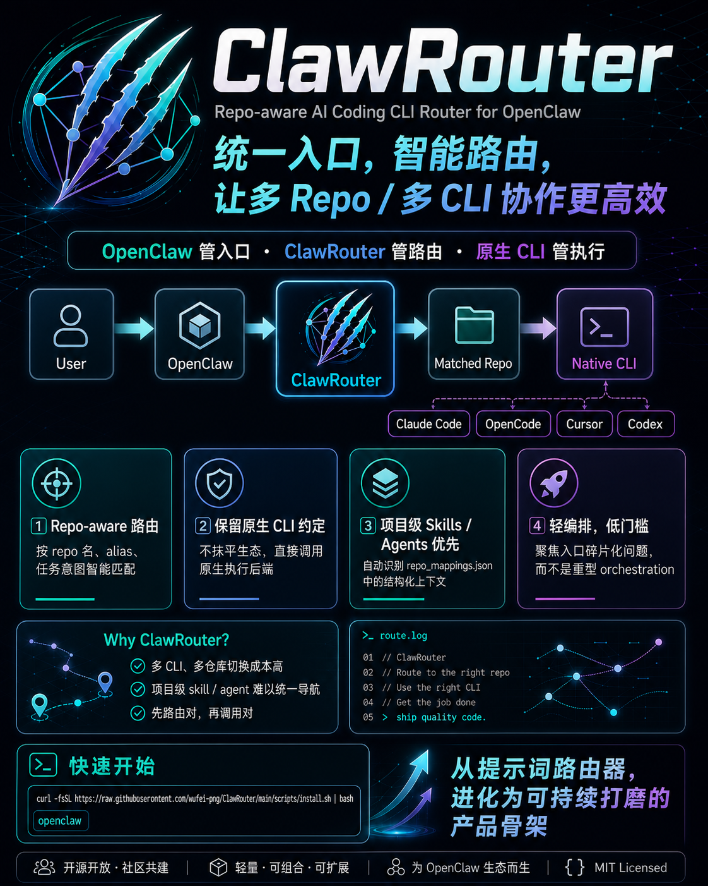

# AgentRepoRouter

中文版 | [English](README.md)

面向多个 agent host 的 repo-aware AI 编程 CLI 路由 skill。

AgentRepoRouter 可以安装到 OpenClaw、Claude Code、OpenCode、Codex 与 Hermes 的 skill 目录。它不会替代这些工具，而是将任务路由到合适的仓库，保留各 CLI 原生的 agent/skill 约定，并利用结构化仓库元数据提升导航与匹配质量。



## 为什么需要 AgentRepoRouter

很多开发者现在同时拥有多个 coding CLI、多个仓库，以及多个自定义 agent/skill 的存放位置。

真正的问题往往不是“如何并行跑 20 个 agent？”，而是：

- 这个任务应该在哪个仓库执行？
- 这个仓库最适合用哪个 CLI？
- 这个仓库里是否已经有应优先使用的项目级 skill 或 agent？
- 如何在保持一个 agent host 入口的同时，不抹平各 CLI 的原生约定？

AgentRepoRouter 就是为这个空白而生。

## 定位

理解 AgentRepoRouter 的最佳方式是：

- OpenClaw、Claude Code、OpenCode、Codex 或 Hermes 都可以作为 skill host。
- AgentRepoRouter 是编码任务的路由层。
- Claude Code、OpenCode、Cursor、Codex、Hermes 仍是实际执行后端。

这意味着 AgentRepoRouter 有意保持轻量，不追求成为完整编排运行时。它聚焦于入口、路由、仓库选择与原生 CLI 调用，而不是任务看板、worktree、PR 生命周期自动化或并行 swarm。

## 研究结论

这一轮仓库调研得出三个实践结论：

- AgentRepoRouter 的价值不在于“击败”重型编排器，而在于作为一层轻而有用的能力，让 agent host 在真实编码任务中具备 repo-aware 与 CLI-aware 能力。
- 最关键的差异化是保留原生 CLI 生态，而不是发明一层把它们隐藏掉的新抽象。
- 随着 `repo_mappings.json` 内嵌 `aliases`、检测到的项目级 `skills` 与 `agents`，AgentRepoRouter 已不再只是薄提示词封装，而是可被支持的 host 稳定导航的结构化路由上下文。

## 快速开始

```bash
# 从 GitHub 安装
curl -fsSL https://raw.githubusercontent.com/wufei-png/AgentRepoRouter/main/scripts/install.sh | bash

# 或本地安装
bash scripts/install.sh

# 查看仓库别名与检测到的项目资产
vim ~/.agents/skills/agent-repo-router/references/repo_mappings.json

# 启动你的 host，例如 OpenClaw
openclaw
```

## 运行形态

```text
用户
  -> OpenClaw / Claude Code / OpenCode / Codex / Hermes
  -> Router Skill
  -> 基于仓库名 / 别名 / 任务意图进行匹配
  -> 从 repo_mappings.json 读取项目级 skill / agent 提示
  -> 直接调用原生 CLI 执行
```

## 当前已实现

- `scripts/install.sh` 会检查 Node.js 18+ 与 Git，并检测可用 agent host。
- 安装器将语言、安装模式、安装 host、执行 CLI 分开选择。
- 默认安装模式为 Global：写入 `~/.agents/skills/agent-repo-router`，并软链接所有检测到的 host。
- Single host 模式直接安装到单个 host 的 skill 目录。
- Custom hosts 模式写入全局规范路径，并软链接选中的 host。
- 项目发现支持自动扫描与手动绝对路径输入。
- 生成的仓库配置包含 `aliases`、检测到的项目级 `skills` 与项目级 `agents`。
- 安装器会写入 schema v2 `repo_mappings.json`，包含 `installMode`、`installHosts` 与 `executionClis`。
- 仓库包含单元、集成、E2E 测试，并提供可选的 OpenClaw 实时 E2E 覆盖。

## 设计原则

### 1. Host 原生安装

AgentRepoRouter 以 skill 形式交付，而不是另起一个 daemon 或控制平面。它可以直接安装到单个 host，也可以全局安装一次并软链接到多个 host。

### 2. 仓库元数据是一等公民

路由质量依赖仓库上下文。因此 `repo_mappings.json` 不只是路径列表，而是一个小型路由目录：

```json
{
  "schemaVersion": 2,
  "installMode": "global",
  "installHosts": ["global", "openclaw", "claude-code", "opencode", "codex", "hermes"],
  "executionClis": ["claude-code", "opencode", "cursor", "codex", "hermes"],
  "repos": [
    {
      "name": "example-backend",
      "path": "/path/to/backend",
      "aliases": ["backend", "api"],
      "skills": {
        "claude-code": [
          {
            "name": "build_and_test",
            "description": "Run build and tests before finishing changes."
          }
        ]
      },
      "agents": {
        "claude-code": [
          {
            "name": "bugfix",
            "description": "Fix bugs and regressions with targeted changes."
          }
        ]
      }
    }
  ]
}
```

### 3. 保留原生 CLI 约定

每个 CLI 都已有自己的调用模型与项目资产约定。AgentRepoRouter 会保留并利用这些差异，而非将其隐藏。

- Claude Code: `claude -p "task"` 或 `claude --agent <name> "task"`
- OpenCode: `opencode run "task"`，通过提示词选择 agent
- Cursor: `agent -p "task"`，通过提示词选择 agent
- Codex: `codex exec "task"`，支持项目级 `.agents/skills/`、`.codex/agents/` 与 `AGENTS.md`
- Hermes: `hermes --oneshot "task"`，使用 Hermes 的 skill 约定

### 4. 项目级资产优先于全局默认

如果仓库已经存在项目级 skill 或 agent，应在附加任何全局辅助能力前被优先视为强提示。

### 5. 显式回退优于隐藏魔法

当没有可靠命中时，AgentRepoRouter 会按 `repo_mappings.json` 中的 `executionClis` 顺序回退，行为可检查、可预期。

## 为什么当前 Schema 很重要

新的 `aliases` 与检测到的 `skills`、`agents` 字段，直接带来旧版最小 schema 无法提供的路由能力提升：

- `aliases` 让 host 能把用户语言映射到仓库昵称，如 `api`、`docs`、`admin`。
- `skills` 让 router 在 CLI 启动前就获得项目级能力提示。
- `agents` 让 router 获得项目级专家提示，而不必依赖弱全局匹配。
- `references/` 目录让运行时 skill 保持简洁，同时将更长的 CLI 约定放入明确的参考文档。

## 对比

下列项目都值得参考，但它们优化的是技术栈中的不同层级。

| 项目 | 主要角色 | 执行模型 | 优化目标 | 与 AgentRepoRouter 的差异 |
| --- | --- | --- | --- | --- |
| [AgentRepoRouter](https://github.com/wufei-png/AgentRepoRouter) | 面向多个 agent host 的 repo-aware 路由 skill | 一个 skill 选择 repo、skill、agent 与 CLI，然后直接调用原生 CLI | 多 coding CLI 的统一入口与可预测路由 | 聚焦路由与原生约定保留，而非完整编排 |
| [OpenClaw](https://github.com/openclaw/openclaw) | 本地优先的个人助理与控制平面 | 在同一助理运行时下管理会话、通道、skills、tools、agents | 通信入口、会话管理、skills、本地优先助理行为 | AgentRepoRouter 是构建在 OpenClaw 之上的 coding skill，不是替代品 |
| [MCO](https://github.com/mco-org/mco) | 并行多 CLI 编排 | 将同一提示词分发到多个 coding CLI 并综合结果 | 并行评审、共识、跨模型对比 | AgentRepoRouter 先选单一路径；MCO 更适合并行评审或共识 |
| [agtx](https://github.com/fynnfluegge/agtx) | 多 agent 任务看板与生命周期管理 | Kanban 看板、tmux 会话、worktree、编排 agent | 在多 agent 会话间维持持续任务流 | AgentRepoRouter 更轻量，不接管看板或 worktree 生命周期 |
| [Agent Orchestrator](https://github.com/ComposioHQ/agent-orchestrator) | 自主化 PR 与 CI 工作流自动化 | 仪表盘 + 隔离 worktree agent，响应 CI 与评审反馈 | 大规模 ticket-to-PR 自动化 | AgentRepoRouter 仅作路由层，避免接管完整交付生命周期 |
| [metaswarm](https://github.com/dsifry/metaswarm) | 强约束的 SDLC 编排框架 | 多阶段流程、多 persona、评审关卡、递归编排 | 强流程控制与自进化交付闭环 | AgentRepoRouter 更少约束、接入更简单、易叠加到现有 OpenClaw |
| [burn-harness](https://github.com/bkmashiro/burn-harness) | 面向 coding agent 的持续任务队列 | 后台循环拉取任务、执行、创建草稿 PR、失败重试 | 持续任务吞吐 | AgentRepoRouter 偏交互与路由，不是后台队列 worker |

## 亮点

- 多 host 部署：全局安装一次并链接检测到的 host，或直接安装到单个 host。
- repo-aware 导航：仓库名、别名、任务意图共同参与路由。
- 结构化项目提示：检测到的项目级 skills/agents 存在配置中，不只存在于提示词文本。
- 低锁定：执行步骤仍使用原始 CLI，而非自定义 wrapper 协议。
- 保留原生约定：AgentRepoRouter 适配 Claude Code、OpenCode、Cursor、Codex、Hermes，而非假设它们完全一致。
- 运行时 skill 精简、参考文档详细：活动 `SKILL.md` 保持可读，细节放在 `references/`。
- 安装器 + 校验：自动生成并校验仓库配置。
- 测试基线完整：包含单元、集成、E2E 及可选实时测试。

## 支持的 CLI

| CLI | 非交互任务命令 | 项目级或自定义配置 |
| --- | --- | --- |
| Claude Code | `claude -p "task"` | `~/.claude/agents/`, `<repo>/.claude/agents/`, `<repo>/.claude/skills/` |
| OpenCode | `opencode run "task"` | `~/.config/opencode/agents/`, `<repo>/.opencode/agents/`, `<repo>/.opencode/skills/` |
| Cursor | `agent -p "task"` | `~/.cursor/agents/`, `<repo>/.cursor/agents/` |
| Codex | `codex exec "task"` | `~/.codex/config.toml`, `.codex/config.toml`, `~/.codex/agents/`, `.codex/agents/`, `.agents/skills/`, `AGENTS.md` |
| Hermes | `hermes --oneshot "task"` | `~/.hermes/skills/software-development/`, Hermes host 配置 |

## 安装目标

| Host | 直接安装路径 |
| --- | --- |
| OpenClaw | `~/.openclaw/skills/agent-repo-router` |
| Claude Code | `~/.claude/skills/agent-repo-router` |
| OpenCode | `~/.config/opencode/skills/agent-repo-router` |
| Codex | `~/.agents/skills/agent-repo-router` |
| Hermes | `~/.hermes/skills/software-development/agent-repo-router` |

Codex 当前公开 [Agent Skills manual](https://developers.openai.com/codex/skills.md) 将用户级 skills 放在 `$HOME/.agents/skills`；`~/.codex/skills` 不是本安装器使用的用户级 skill 发现路径。

Codex 官方也支持 `codex exec -C /path/to/repo "task"`。AgentRepoRouter 文档仍统一使用 `cd /path && ...` 写法，以保持跨 CLI 的路由模式一致。

## 示例

```text
用户："修复 api 项目的鉴权 bug，并使用该仓库的 build_and_test skill。"

Router:
1. 匹配仓库别名 `api` -> `example-backend`
2. 读取检测到的项目 skills -> `build_and_test`
3. 读取检测到的项目 agents -> `bugfix`
4. 选择最佳原生 CLI 路径
5. 在目标仓库直接执行
```

## 何时适合使用 AgentRepoRouter

当你希望获得以下能力时，使用 AgentRepoRouter：

- 以已有 agent host 作为统一入口
- 同时管理多个仓库与多个 coding CLI
- 路由时尊重项目级 skills 与 agents
- 使用比完整 agent swarm 或 kanban 编排器更轻的一层

当需要时可与其他工具配合：

- 需要同一任务由多个 CLI 并行评审时，使用 MCO
- 需要重度 worktree 生命周期自动化时，使用 agtx 或 Agent Orchestrator
- 需要更强约束的 SDLC 流程时，使用 metaswarm

## 文档

- [CLAUDE.md](CLAUDE.md) - 完整项目上下文
- [docs/ARCHITECTURE.md](docs/ARCHITECTURE.md) - 当前架构与运行时约定
- [docs/PRODUCT.md](docs/PRODUCT.md) - 未来路线图（非当前实现）
- [docs/advertisement/why-agent-repo-router.md](docs/advertisement/why-agent-repo-router.md) - 面向潜在用户的推荐文章
- [docs/plans/migration/plan.md](docs/plans/migration/plan.md) - 迁移历史与实施计划
- [legacy/README.md](legacy/README.md) - 历史归档资料
