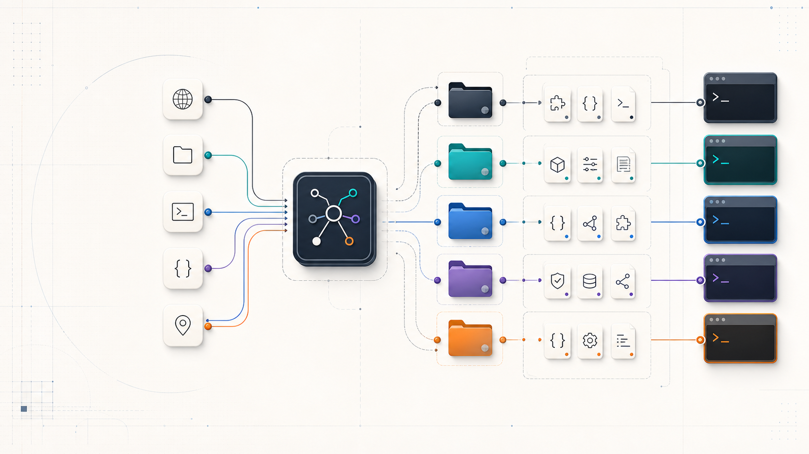

# 已经有 Claude Code、Codex、Cursor、OpenCode、Hermes，为什么还要 AgentRepoRouter

如果你只用一个 coding CLI，只有一两个 repo，AgentRepoRouter 可能不是刚需。

但很多人现在的工作台已经变成这样：Claude Code、Codex、Cursor、OpenCode、Hermes 都在用；每个项目又有自己的 skill、agent、AGENTS.md 或本地约定。真正烦人的地方不是模型不够多，而是每次开工前都要先想一遍：

- 这个任务该进哪个 repo？
- 这个 repo 的路径在哪里？
- 这个项目有没有已经写好的 skill 或 agent？
- 这次更适合交给哪个 CLI？
- 我能不能继续从当前 host 发起，而不是手动切到另一套工具？

AgentRepoRouter 解决的就是这层导航问题。



## 它不是新的执行平台

AgentRepoRouter 不替代 OpenClaw、Claude Code、OpenCode、Codex 或 Hermes，也不接管它们的运行时。

它是一个可安装到多个 agent host 的 skill。安装后，host 先读取 `repo_mappings.json`，根据 repo 名、alias、项目级 skill/agent 摘要和默认 CLI 顺序做路由判断。真正执行时，仍然调用原生 CLI。

更准确地说：

> Agent host 管入口，AgentRepoRouter 管路由，原生 CLI 管执行。

这也是它和重型 orchestration 平台的边界。它不做任务看板，不管理 worktree 生命周期，不负责 PR、CI、review comments 的全自动闭环。它先把入口、仓库和执行 CLI 选对。

## 当前实现已经做到什么

当前版本不是一个只写在 README 里的想法。仓库里已经有可用的安装器、schema v2 配置、Router Skill 和测试。

安装器会做这些事：

- 检查 Node.js 18+ 和 Git。
- 选择中文或英文 skill。
- 选择安装模式：Global、Single host 或 Custom hosts。
- 选择要安装到哪些 host：OpenClaw、Claude Code、OpenCode、Codex、Hermes。
- 选择可作为执行后端的 CLI：Claude Code、OpenCode、Cursor、Codex、Hermes。
- 通过自动扫描或手动输入收集本地 repo。
- 生成 `references/repo_mappings.json`。
- 部署选定语言的 `SKILL.md` 和对应 `references/guide.*.md`。

默认的 Global 模式会把规范副本写到：

```text
~/.agents/skills/agent-repo-router/
```

然后把检测到的 host skill 目录软链接到这里。Single host 模式则直接写入某一个 host 的 skill 目录。Codex 目标本身就是 `~/.agents/skills/agent-repo-router`，不会创建 `~/.codex/skills`。

## `repo_mappings.json` 才是重点

AgentRepoRouter 的路由上下文都在 `repo_mappings.json` 里。

配置结构大致是这样：

```json
{
  "schemaVersion": 2,
  "installMode": "global",
  "installHosts": ["global", "openclaw", "claude-code", "opencode", "codex", "hermes"],
  "executionClis": ["claude-code", "opencode", "cursor", "codex", "hermes"],
  "repos": [
    {
      "name": "my-backend",
      "path": "/path/to/backend",
      "aliases": ["backend", "api"],
      "skills": {},
      "agents": {}
    }
  ]
}
```

这里有一个需要说清楚的点：安装器不会替你猜 alias。新扫描出来的 repo 默认是 `aliases: []`。你需要自己把 `api`、`admin`、`docs` 这类日常叫法补进去。

安装器会扫描项目里的部分已知目录，提取 project-level skills 和 agents 的名称与描述，写入 `skills` 和 `agents` 字段。Router Skill 会把这些信息当作强提示，而不是凭空创建能力。

这比单纯保存路径有用得多。Router 不只知道“这个目录存在”，还知道“这个 repo 里可能已经有 build_and_test skill”或“这个 repo 里有 bugfix agent”。

## 它保留各 CLI 的原生约定

AgentRepoRouter 没有把所有 CLI 包成一套新协议。它保留各自的调用方式：

| CLI | 命令形态 |
| --- | --- |
| Claude Code | `cd /path && claude -p "task"` |
| Claude Code agent | `cd /path && claude --agent <name> "task"` |
| OpenCode | `cd /path && opencode run "task"` |
| Cursor | `cd /path && agent -p "task"` |
| Codex | `cd /path && codex exec "task"` |
| Hermes | `cd /path && hermes --oneshot "task"` |

OpenCode 和 Cursor 的自定义 agent 目前通过提示词调用，例如 `use agent <name> to do...`。Codex 的项目级 skill、agent 和 `AGENTS.md` 也按 Codex 自己的目录约定处理。

这点很重要。很多统一层为了“统一”，会把原生差异藏起来，最后排查问题时反而更难。AgentRepoRouter 的选择更朴素：入口统一，执行保持原样。

## 路由顺序很简单

Router Skill 的判断顺序是：

1. 先确定目标 repo。用户明确说了项目，就优先用用户指定的项目；没说清楚时，再根据 repo name、alias 和任务内容判断。
2. 在目标 repo 里优先看项目级 skill 和 agent。`repo_mappings.json` 里已经检测到的摘要会作为强提示。
3. 项目级没有可靠命中时，再保守考虑全局 skill 和 agent。
4. 还是没有可靠命中，就按 `executionClis` 的顺序回退到默认 CLI。

这个顺序不会让它变成万能调度器，但能让行为更可检查。你可以打开配置文件，看它为什么会优先想到某个 repo 或某个 CLI。

## 一个典型场景

假设你对已安装 AgentRepoRouter 的 host 说：

```text
fix the auth bug in the api project, use the repo's build_and_test skill
```

如果你已经在配置里给后端仓库加了 `api` alias，并且安装器检测到了 `build_and_test`，Router 可以这样处理：

1. 用 `api` 命中目标 repo。
2. 读取该 repo 下已检测的 `build_and_test` skill 摘要。
3. 如果有匹配的项目级 agent，比如 `bugfix`，把它也作为执行提示。
4. 按 CLI 原生约定生成执行方式。
5. 在目标 repo 里调用对应 CLI。

这个流程不花哨，但很省心。你少做一次找路径、查配置、切 CLI 的重复动作。

## 适合谁

AgentRepoRouter 适合这些人：

- 已经把某个 agent host 当作日常入口。
- 同时使用两个或更多 coding CLI。
- 本地有多个 repo，经常在它们之间切换。
- repo 里已经维护了 project-level skills 或 agents。
- 想要轻一点的路由层，而不是一上来就引入完整编排平台。

它不太适合这些需求：

- 同一个任务并行跑多个 CLI，再做结果共识。
- 自动管理 worktree、PR、CI 和 review comments 的完整生命周期。
- 强约束的多阶段 SDLC 编排。

这些场景可以交给 MCO、agtx、Agent Orchestrator、metaswarm 一类更重的工具。AgentRepoRouter 更适合放在前面，先把入口和 repo 路由理顺。

## 为什么现在可以试

现在这个版本已经有几个可验证的基础：

- 安装器。
- schema v2 `repo_mappings.json`。
- repo aliases 字段。
- project-level skills 和 agents 检测。
- 中英文 Router Skill。
- `references/` 文档拆分 CLI 细节。
- 单元测试、集成测试、E2E 测试和可选 live E2E。

它还不是完整编排产品，但已经够用来验证一个判断：多 CLI、多 repo、多项目级资产的入口问题，可以先用一个轻量 skill 解决。

## 快速开始

```bash
curl -fsSL https://raw.githubusercontent.com/wufei-png/AgentRepoRouter/main/scripts/install.sh | bash
openclaw
```

安装完成后，先看这个文件：

```text
~/.agents/skills/agent-repo-router/references/repo_mappings.json
```

把常用 repo alias 补好，再检查自动检测到的 skills 和 agents 是否准确。做到这一步，AgentRepoRouter 才真正知道你平时说的 `api`、`admin`、`docs` 分别指向哪里。
